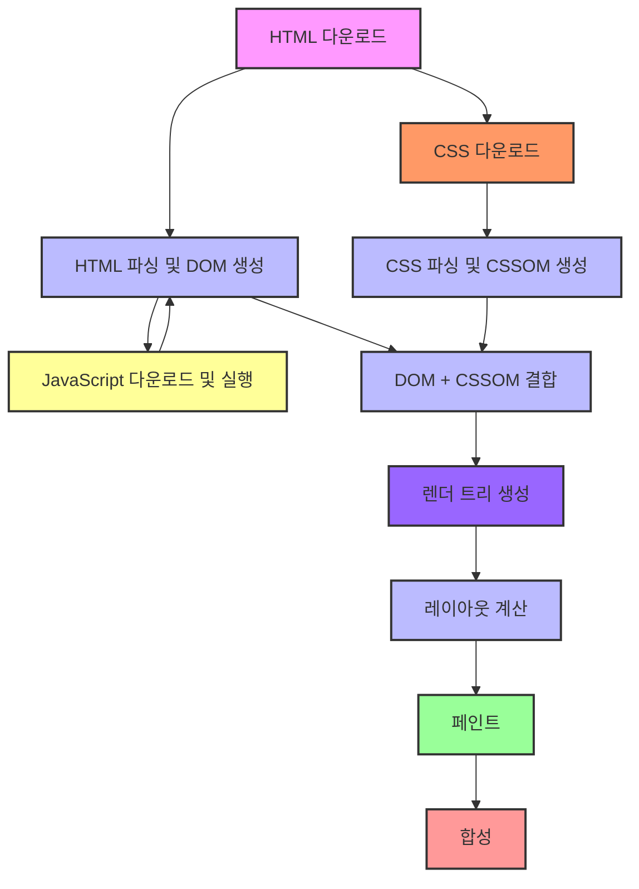

# Critical Rendering Path (CRP)

브라우저가 HTML, CSS, JavaScript 등 웹 페이지의 리소스를 사용해 화면에 페이지를 그리는 과정입니다.
이 과정을 이해하면 웹 페이지 로딩 시간을 줄이고, 사용자 경험을 개선하는 최적화가 가능합니다.
CRP는 브라우저가 페이지를 화면에 표시하기 위해 수행해야 하는 작업의 일련의 단계들을 의미합니다.
이 경로는 HTML, CSS, JavaScript가 어떻게 파싱되고, DOM과 CSSOM을 생성하며, 이들이 최종적으로 화면에 표시되는지 설명합니다.

CRP는 크게 다음의 단계를 포함합니다:

1. HTML 파싱 및 DOM 생성

- HTML 파싱: 브라우저는 서버로부터 HTML 문서를 받아들인 후, 이를 파싱해 DOM(Document Object Model) 트리를 만듭니다.
- DOM 생성: HTML 태그가 파싱될 때마다 브라우저는 DOM 트리에 요소 노드를 추가합니다. DOM은 페이지의 구조와 내용을 계층적으로 나타낸 트리입니다.

```
HTML -> Parsing -> DOM 생성
```

2. CSS 파싱 및 CSSOM 생성

- CSS 파싱: HTML을 파싱하는 동안, 브라우저는 `<link>` 태그나 `<style>` 태그에 정의된 외부 CSS 파일 및 인라인 CSS를 파싱합니다.
- CSSOM 생성: 브라우저는 CSS 규칙을 파싱하여 **CSSOM(CSS Object Model)**이라는 또 다른 트리를 만듭니다. CSSOM은 CSS 스타일 정보가 구조화된 트리로, DOM과 함께 화면을
  렌더링하는 데 사용됩니다.

```
CSS -> Parsing -> CSSOM 생성
```

3. 렌더 트리 생성

- 렌더 트리(Render Tree) 생성: DOM과 CSSOM을 결합하여 렌더 트리가 만들어집니다. 렌더 트리는 페이지의 시각적 요소를 표현하며, 실제 화면에 표시되는 요소들로 구성됩니다.
- 렌더 트리는 화면에 표시되지 않는 요소들(예: display: none으로 숨겨진 요소들)을 포함하지 않습니다.
- 렌더 트리는 스타일과 레이아웃 정보도 포함하고 있습니다.

```
JavaScript -> 다운로드 및 실행 -> DOM/CSSOM 생성에 영향
```

4. 레이아웃 계산

- 레이아웃(Layout): 렌더 트리에서 각 요소의 정확한 크기와 위치를 계산합니다. 이 단계에서는 뷰포트를 기준으로 모든 요소가 어디에 위치하고, 어느 정도의 크기를 가지는지 결정됩니다. 이는 “기하학적
  계산”이라고도 할 수 있습니다.
- 브라우저는 요소가 화면에서 어디에 놓여야 할지 결정하기 위해 모든 요소의 레이아웃을 계산합니다.

```
Render Tree -> Layout 계산
```

5. 페인트(Paint)

- 페인트(Paint): 요소의 스타일 속성에 따라 각 요소가 화면에 그려집니다. 이는 색상, 테두리, 그림자 등과 같이 각 요소의 시각적인 부분을 그리는 과정입니다.
- 페인트는 렌더 트리의 각 요소를 비트맵에 그려 브라우저 화면에 나타나도록 만듭니다.

```
Layout -> Paint (픽셀로 그리기)
```

6. 합성(Composite)

- 합성(Compositing): 화면에 표시될 수 있도록 여러 레이어로 나누어진 요소들이 최종적으로 합쳐져 화면에 나타납니다. 레이어는 GPU 가속을 사용할 수 있는 부분이며, 특히 애니메이션 효과나 스크롤
  등과 같은 고성능 그래픽 처리를 위해 사용됩니다.

```
여러 Layer -> Compositing -> 화면 표시
```



CRP 최적화 기법

CRP는 웹 페이지 성능에 큰 영향을 미치기 때문에 최적화를 통해 페이지 로딩 속도를 개선할 수 있습니다. 최적화의 주요 목표는 렌더링을 차단하는 리소스를 최소화하고, 렌더링 단계를 더 빨리 시작하도록 돕는
것입니다.

	1.	Critical CSS 인라인화: 페이지가 렌더링되는 데 필수적인 CSS를 HTML에 인라인하여 첫 번째 렌더링을 빠르게 합니다.
	2.	JavaScript 로딩 최적화: JavaScript는 HTML 파싱을 차단할 수 있습니다. 이를 피하기 위해 async나 defer 속성을 사용하여 스크립트를 비동기적으로 로드하거나, HTML 파싱 이후에 실행되도록 합니다.
	3.	리소스 최소화: HTML, CSS, JavaScript 파일을 압축하고 **최소화(minify)**하여 파일 크기를 줄입니다.
	4.	Lazy Loading: 이미지와 같이 초기 렌더링에 필요하지 않은 리소스를 나중에 로드하여 렌더링 속도를 개선합니다.
	5.	캐싱 활용: 브라우저 캐시를 활용하여 리소스를 저장하고, 재방문 시 로딩 속도를 줄입니다.

요약

	•	Critical Rendering Path는 브라우저가 웹 페이지를 화면에 렌더링하기 위한 필수적인 과정을 의미하며, DOM, CSSOM, 렌더 트리 생성, 레이아웃, 페인트, 합성의 단계를 거칩니다.
	•	CRP를 최적화하여 렌더링을 차단하는 리소스를 최소화하면 초기 로딩 속도를 개선할 수 있습니다.
	•	CSS와 JavaScript의 위치와 로딩 방식을 최적화하면 CRP에서 발생할 수 있는 렌더링 지연을 줄여 사용자 경험을 향상시킬 수 있습니다.

CRP를 최적화하는 것은 사용자에게 더 빠르고 매끄러운 경험을 제공하기 위해 중요한 부분입니다.
