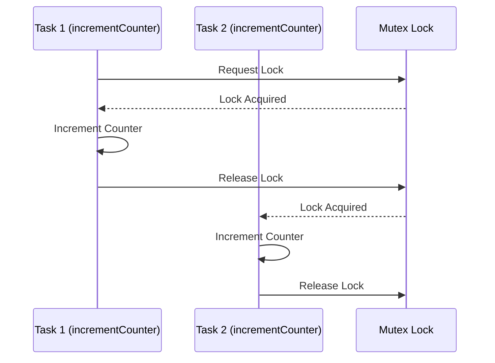

동시성 문제는 여러 작업이 동시에 수행될 때 발생할 수 있는 다양한 문제를 의미합니다. JavaScript는 주로 싱글 스레드 기반 언어이지만, 비동기 처리를 지원하는 방식으로 동시성 문제를 겪을 수 있습니다.
대표적인 예로 경쟁 조건(race conditions)이나 데이터 무결성 문제가 있습니다.

여기서는 동시성 문제를 이해하기 쉽게 설명하고, 해결 방법을 예시 코드와 함께 제공하겠습니다.

### 1. 동시성 문제: 경쟁 조건

경쟁 조건은 두 개 이상의 비동기 작업이 동시에 실행되며, 서로 간섭하여 의도치 않은 결과를 초래하는 상황을 의미합니다. 예를 들어, 여러 비동기 요청이 동일한 데이터에 접근하거나 수정할 때 문제가 발생할 수
있습니다.

```javascript
let counter = 0;

async function incrementCounter() {
    // 네트워크 요청이나 비동기 처리가 필요하다고 가정합니다.
    let temp = counter;
    await new Promise(resolve => setTimeout(resolve, 100));
    counter = temp + 1;
}

async function main() {
    await Promise.all([incrementCounter(), incrementCounter()]);
    console.log(counter); // 예상: 2, 실제: 1
}

main();
```

위 예시에서 `incrementCounter` 함수가 동시에 실행되면 `counter` 값이 올바르게 증가하지 않을 수 있습니다. 이는 `counter`를 읽고 증가시키는 중간에 다른 작업이 개입할 수 있기
때문입니다.

### 2. 해결 방법: Mutex 사용하기

경쟁 조건을 방지하기 위한 일반적인 해결책 중 하나는 **Mutex(뮤텍스)** 를 사용하는 것입니다. JavaScript에서 직접적인 Mutex 객체는 없지만, 유사한 역할을 수행하는 `lock`을 구현할 수
있습니다.

```javascript
class Mutex {
    constructor() {
        this._locked = false;
        this._waiting = [];
    }

    async lock() {
        while (this._locked) {
            await new Promise(resolve => this._waiting.push(resolve));
        }
        this._locked = true;
    }

    unlock() {
        this._locked = false;
        if (this._waiting.length > 0) {
            const next = this._waiting.shift();
            next();
        }
    }
}

const mutex = new Mutex();
let counter = 0;

async function incrementCounter() {
    await mutex.lock();
    try {
        let temp = counter;
        await new Promise(resolve => setTimeout(resolve, 100));
        counter = temp + 1;
    } finally {
        mutex.unlock();
    }
}

async function main() {
    await Promise.all([incrementCounter(), incrementCounter()]);
    console.log(counter); // 예상: 2, 실제: 2
}

main();
```

이 예제에서는 `Mutex` 클래스를 사용하여 `incrementCounter` 함수가 동시에 실행되지 않도록 보장합니다. `lock()`이 호출되면 다른 작업은 잠금이 해제될 때까지 대기합니다. 이를 통해 경쟁
조건을 피할 수 있습니다.

### 3. 동시성 문제 해결을 위한 다이어그램

동시성 문제와 Mutex를 이용한 해결 방법을 쉽게 이해할 수 있도록 다이어그램을 추가하겠습니다.



위 다이어그램은 두 개의 비동기 작업(Task 1과 Task 2)이 동일한 자원(`counter`)을 수정하려 할 때, Mutex를 통해 순차적으로 처리되는 과정을 보여줍니다. Mutex가 없으면 두 작업이 동시에
실행되어 경쟁 조건이 발생할 수 있지만, Mutex를 사용하면 하나씩 순차적으로 안전하게 작업을 진행할 수 있습니다.

### 4. 결론

동시성 문제는 여러 비동기 작업이 공유 자원에 접근하거나 수정할 때 발생할 수 있습니다. 경쟁 조건을 피하기 위해 `Mutex`와 같은 동기화 메커니즘을 사용할 수 있으며, 이를 통해 데이터 무결성을 보장할 수
있습니다.

이러한 원칙은 서버 사이드 자바스크립트(Node.js)와 같은 환경에서도 유효하며, 멀티스레드가 지원되는 환경에서 특히 중요합니다.
