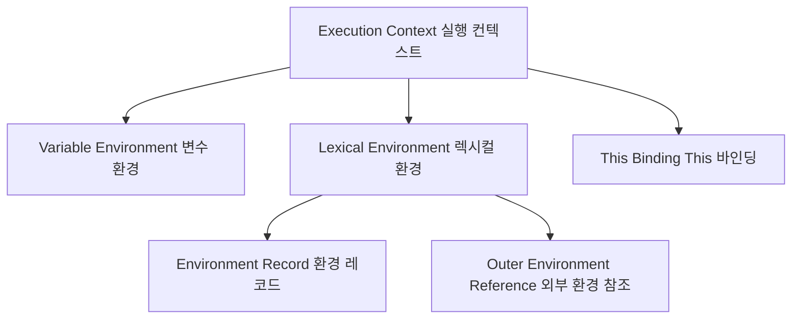
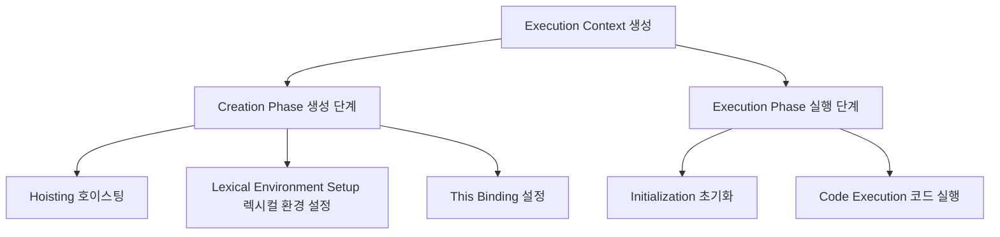

# 실행 컨텍스트의 주요 구성 요소 (Components of Execution Context)

## 개요

실행 컨텍스트는 자바스크립트 코드가 실행되는 환경으로, 실행되는 동안 여러 요소와 단계로 코드의 실행을 관리합니다. 각 실행 컨텍스트는 여러 구성 요소로 이루어져 있습니다.

## 실행 컨텍스트 구성 요소

- **Variable Environment (변수 환경)**
    - 변수와 함수 선언이 저장되는 공간입니다.
    - `var`로 선언된 변수와 함수 선언이 저장됩니다.

- **Lexical Environment (렉시컬 환경)**
    - **Environment Record (환경 레코드)**
        - 현재 컨텍스트 내의 변수, 함수 등의 정보가 저장되는 공간입니다.
    - **Outer Environment Reference (외부 환경 참조)**
        - 외부 렉시컬 환경을 참조하는 포인터로, 현재 컨텍스트에서 상위 스코프를 찾기 위해 사용됩니다.

- **This Binding (This 바인딩)**
    - 실행 컨텍스트 내에서 `this`가 가리키는 값을 저장합니다.
    - 함수 호출 방식에 따라 `this` 값이 달라집니다.

## 구성 요소 간의 관계

***

# 실행 컨텍스트의 생성과 실행 과정

## 개요

자바스크립트에서 실행 컨텍스트는 코드가 실행되는 동안 특정 단계를 거치며, 코드의 실행과 변수 초기화를 관리합니다. 실행 컨텍스트는 크게 **생성 단계 (Creation Phase)** 와 **실행 단계 (
Execution Phase)** 로 나뉩니다.

## 실행 컨텍스트의 생성 단계 (Creation Phase)

실행 컨텍스트가 생성될 때 자바스크립트 엔진은 다음의 작업을 수행합니다.

1. **변수 및 함수 선언의 호이스팅 (Hoisting)**
    - 모든 변수와 함수 선언이 메모리에 저장됩니다.
    - `var`로 선언된 변수들은 **초기화되지 않은 상태로** 메모리에 할당되고, 기본적으로 `undefined`로 설정됩니다.
    - 함수 선언은 전체가 메모리에 저장되며, 어디서든 참조 가능해집니다.

2. **Lexical Environment 설정 (Lexical Environment Setup)**
    - 렉시컬 환경이 설정되어 **스코프 체인 (Scope Chain)**이 결정됩니다.
    - 블록 스코프를 가지는 `let`과 `const` 변수들도 메모리에 저장되지만, 이들은 **Temporal Dead Zone (TDZ)**에 놓여 초기화 전까지 접근이 불가능합니다.

3. **This 바인딩 설정 (This Binding)**
    - 실행 컨텍스트의 `this` 값이 설정됩니다.
    - `this`는 함수 호출 방식에 따라 다르게 설정됩니다 (예: 전역 객체, 객체의 메서드 등).

## 실행 컨텍스트의 실행 단계 (Execution Phase)

실행 컨텍스트가 생성된 이후, 코드는 **실행 단계**에 진입하며 실제 코드가 한 줄씩 실행됩니다.

1. **변수의 초기화 (Initialization)**
    - **생성 단계**에서 메모리에 저장된 변수들이 실제 할당 값을 가지게 됩니다.
    - `var`로 선언된 변수는 `undefined`에서 초기화됩니다.
    - `let`과 `const`는 선언 이후 처음 초기화될 때 값이 할당됩니다.

2. **코드의 실행 (Execution)**
    - 코드가 한 줄씩 실행되며, 함수 호출이나 변수 참조 등이 이루어집니다.
    - 이 과정에서 함수가 호출되면 새로운 실행 컨텍스트가 생성되어 **콜 스택 (Call Stack)**에 쌓입니다.

## 실행 컨텍스트 생성과 실행 과정의 다이어그램

